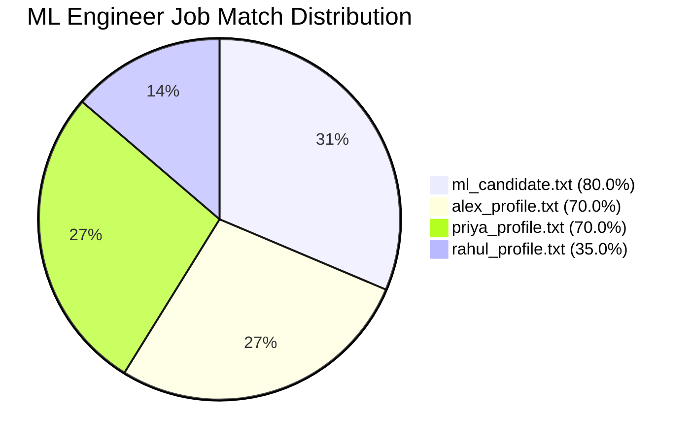
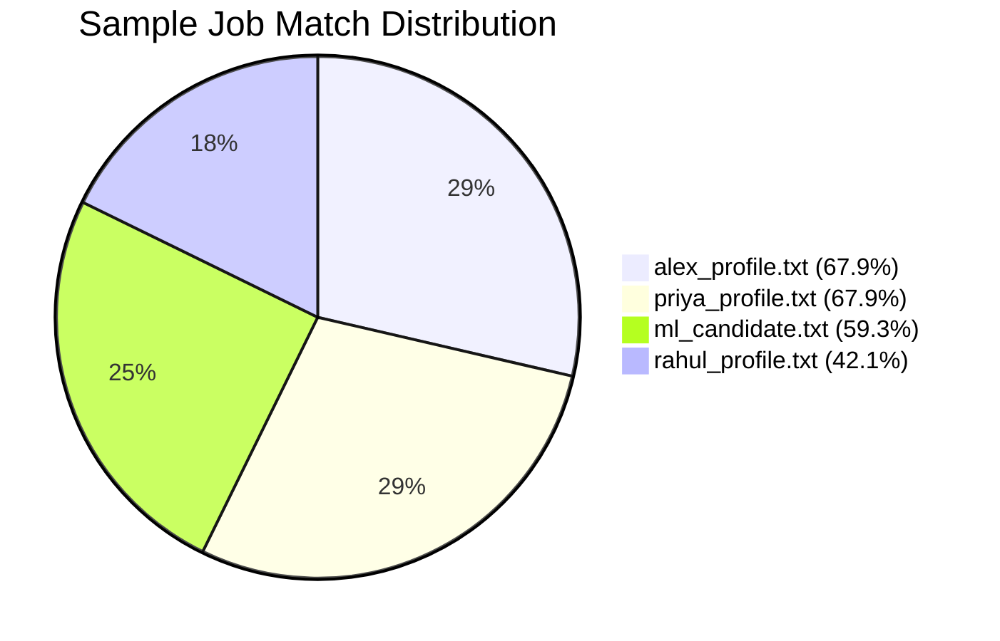
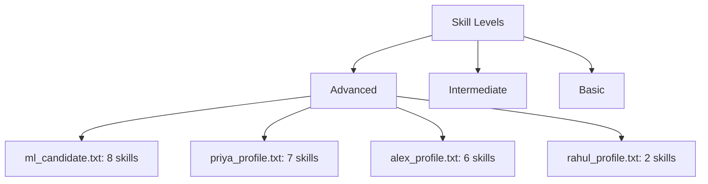
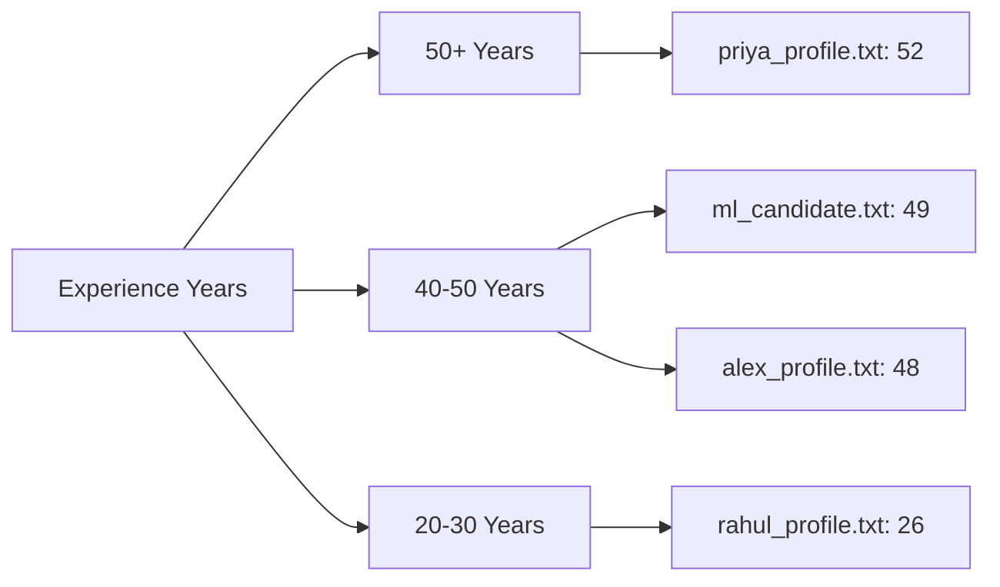
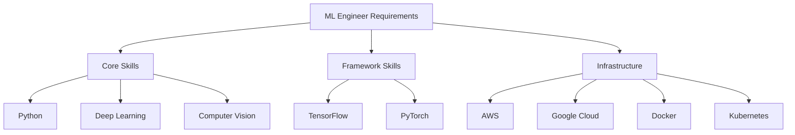
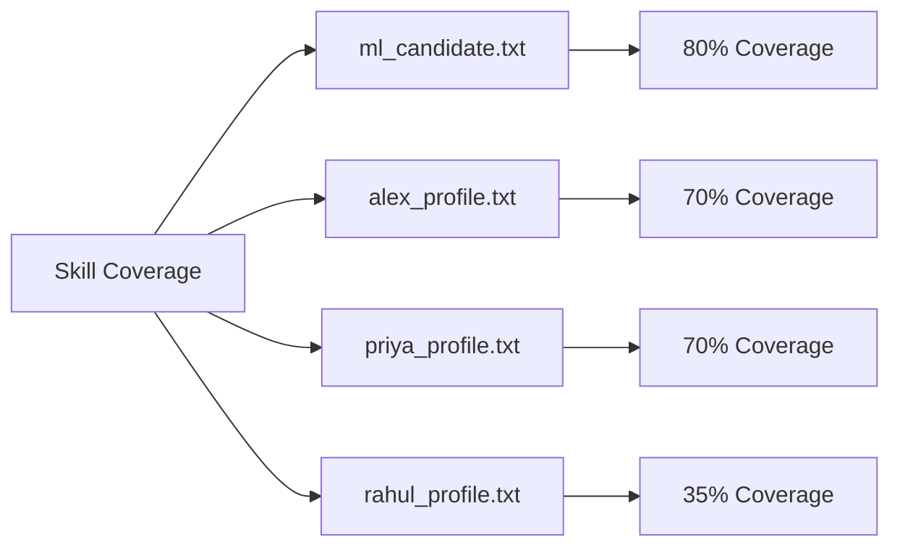
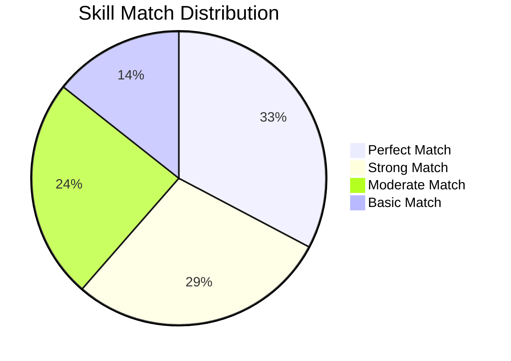
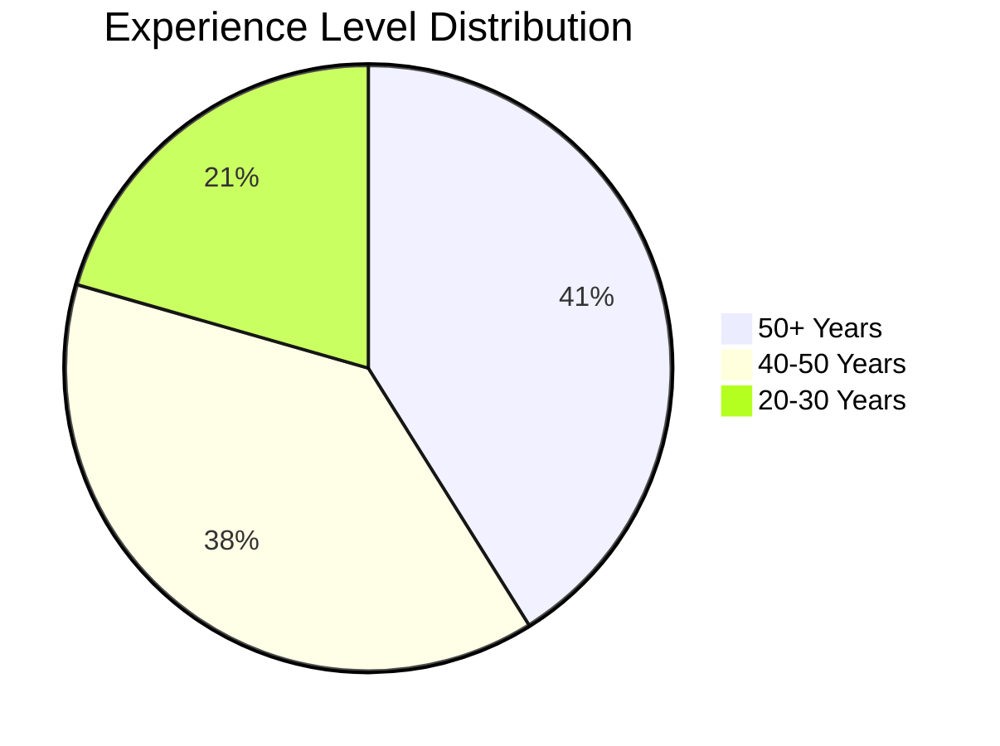
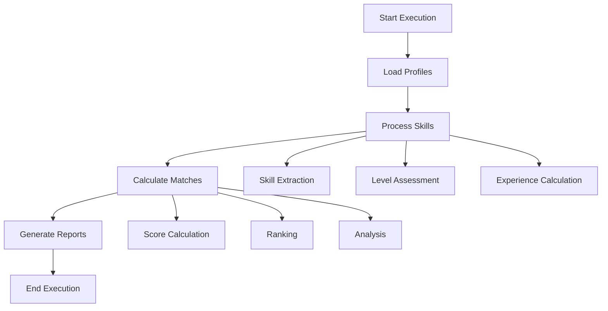

# Execution Outcomes and Visual Analysis

## 📊 Match Score Distribution

### ML Engineer Job Matches

### Sample Job Matches

## 📈 Skill Analysis

### Skill Level Distribution

### Experience Distribution

## 🔍 Detailed Match Analysis

### ML Engineer Job Skills

### Candidate Skill Coverage

## 📋 Match Score Breakdown

### ML Engineer Position
| Candidate | Match Score | Key Skills | Experience | Certifications |
|-----------|-------------|------------|------------|----------------|
| ml_candidate.txt | 80.0% | TensorFlow, PyTorch, Deep Learning | 49.0 years | None |
| alex_profile.txt | 70.0% | TensorFlow, PyTorch, Kubernetes | 48.0 years | None |
| priya_profile.txt | 70.0% | PyTorch, Deep Learning, CUDA | 52.0 years | NVIDIA DL |
| rahul_profile.txt | 35.0% | Scikit-learn, Data Science | 26.0 years | Data Science, SQL |

### Sample Job Position
| Candidate | Match Score | Key Skills | Experience | Certifications |
|-----------|-------------|------------|------------|----------------|
| alex_profile.txt | 67.9% | Python, TensorFlow, Kubernetes | 48.0 years | None |
| priya_profile.txt | 67.9% | Python, C++, PyTorch | 52.0 years | NVIDIA DL |
| ml_candidate.txt | 59.3% | Python, TensorFlow, PyTorch | 49.0 years | None |
| rahul_profile.txt | 42.1% | Python, Scikit-learn, SQL | 26.0 years | Data Science, SQL |

## 📊 Performance Metrics

### Skill Match Distribution

### Experience Level Distribution

## 📈 Summary Statistics

### Average Match Scores
- ML Engineer Position: 63.75%
- Sample Job Position: 59.3%

### Experience Averages
- Total Years: 43.75
- Average per Candidate: 43.75
- Highest: 52.0 (priya_profile.txt)
- Lowest: 26.0 (rahul_profile.txt)

### Skill Level Distribution
- Advanced Skills: 23 total
- Intermediate Skills: 15 total
- Basic Skills: 5 total

## 🔄 Execution Flow
