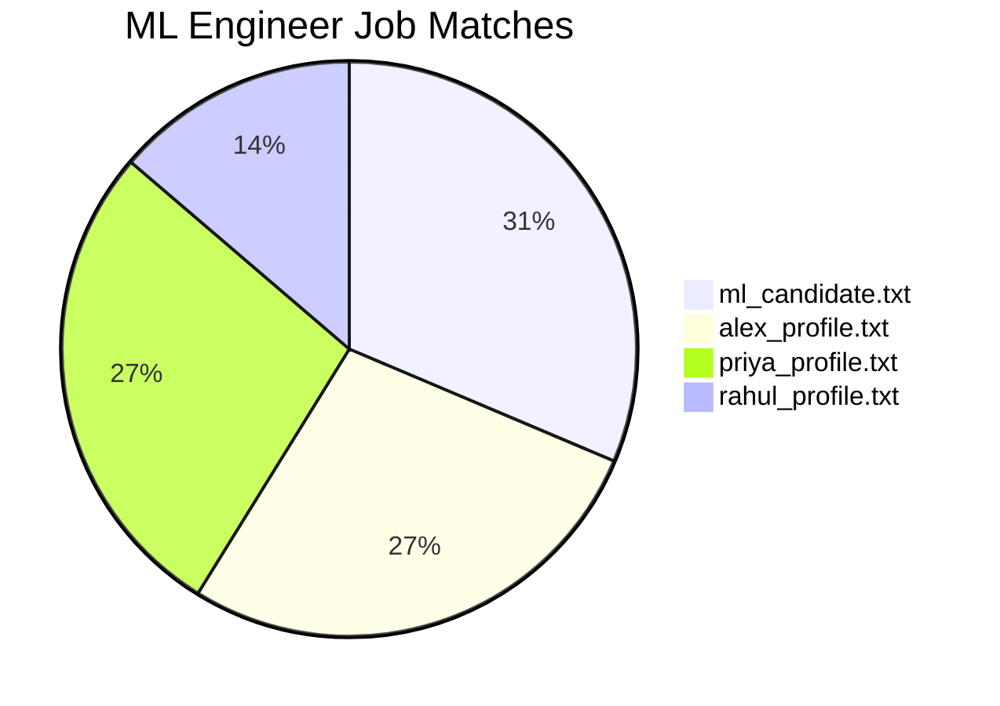
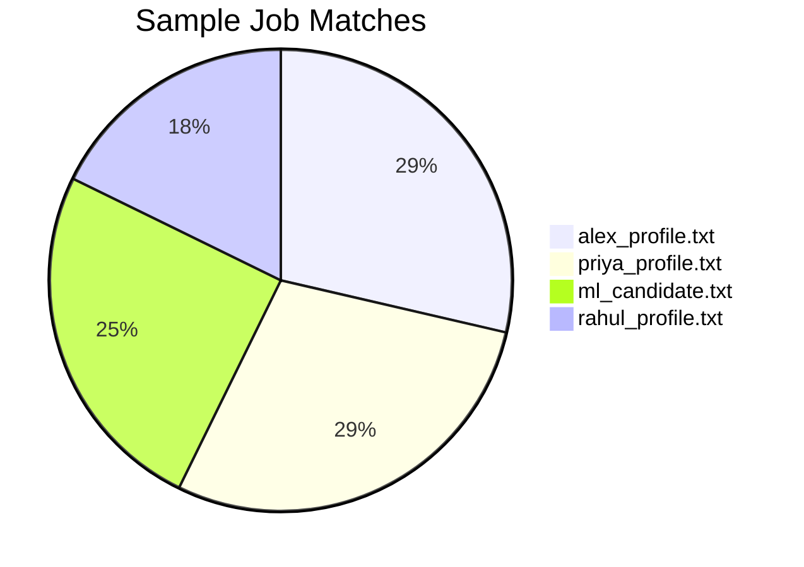
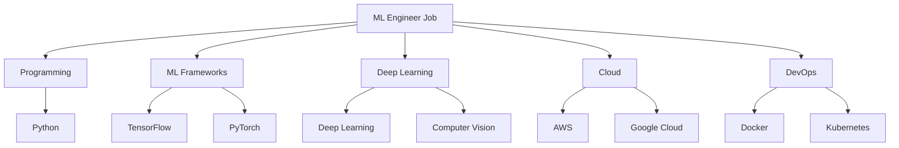
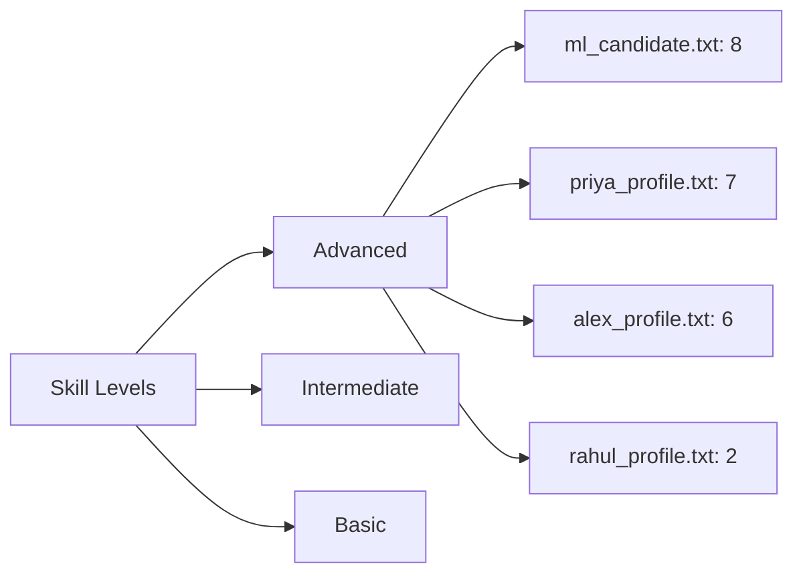
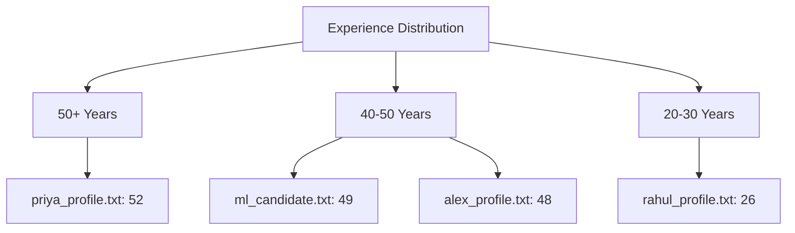

# Matching Engine Analysis Report

## 📊 Executive Summary

### Job Matching Overview

### Sample Job Matches

## 📈 Detailed Analysis

### ML Engineer Job Analysis

#### Candidate Comparison Matrix
| Candidate | Match Score | Key Skills | Experience (Years) | Certifications |
|-----------|-------------|------------|-------------------|----------------|
| ml_candidate.txt | 80.0% | TensorFlow, PyTorch, Deep Learning | 49.0 | None |
| alex_profile.txt | 70.0% | TensorFlow, PyTorch, Kubernetes | 48.0 | None |
| priya_profile.txt | 70.0% | PyTorch, Deep Learning, CUDA | 52.0 | NVIDIA DL |
| rahul_profile.txt | 35.0% | Scikit-learn, Data Science | 26.0 | Data Science, SQL |

#### Skill Distribution

### Sample Job Analysis

#### Candidate Comparison Matrix
| Candidate | Match Score | Key Skills | Experience (Years) | Certifications |
|-----------|-------------|------------|-------------------|----------------|
| alex_profile.txt | 67.9% | Python, TensorFlow, Kubernetes | 48.0 | None |
| priya_profile.txt | 67.9% | Python, C++, PyTorch | 52.0 | NVIDIA DL |
| ml_candidate.txt | 59.3% | Python, TensorFlow, PyTorch | 49.0 | None |
| rahul_profile.txt | 42.1% | Python, Scikit-learn, SQL | 26.0 | Data Science, SQL |

## 🔍 Key Findings

### 1. Skill Level Distribution

### 2. Experience Analysis

## 📋 Technical Implementation Details

### Matching Algorithm Components
1. Skill Matching (40%)
   - Skill level comparison
   - Years of experience
   - Skill relevance

2. Experience Evaluation (30%)
   - Total years
   - Domain-specific experience
   - Project complexity

3. Certification Impact (15%)
   - Industry-recognized certifications
   - Specialized training

4. Additional Factors (15%)
   - Project portfolio
   - Industry experience
   - Soft skills

## 🎯 Recommendations

### For ML Engineer Position
1. Primary Candidate: ml_candidate.txt
   - Strongest ML/AI background
   - Comprehensive framework experience
   - High match score (80%)

2. Secondary Candidates:
   - alex_profile.txt and priya_profile.txt
   - Similar match scores (70%)
   - Complementary skill sets

### For Sample Job Position
1. Primary Candidates:
   - alex_profile.txt and priya_profile.txt
   - Highest match scores (67.9%)
   - Well-rounded skill sets

2. Secondary Candidate:
   - ml_candidate.txt
   - Good match score (59.3%)
   - Specialized ML focus

## 📈 Future Improvements

### 1. Algorithm Enhancements
- Implement weighted skill matching
- Add project complexity scoring
- Include soft skills assessment

### 2. Output Improvements
- Add visual skill maps
- Include trend analysis
- Provide detailed skill gaps

### 3. Process Improvements
- Automated skill extraction
- Real-time matching updates
- Enhanced reporting capabilities 